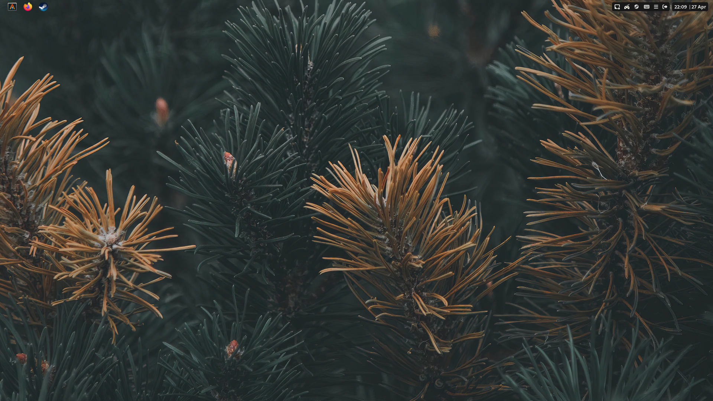
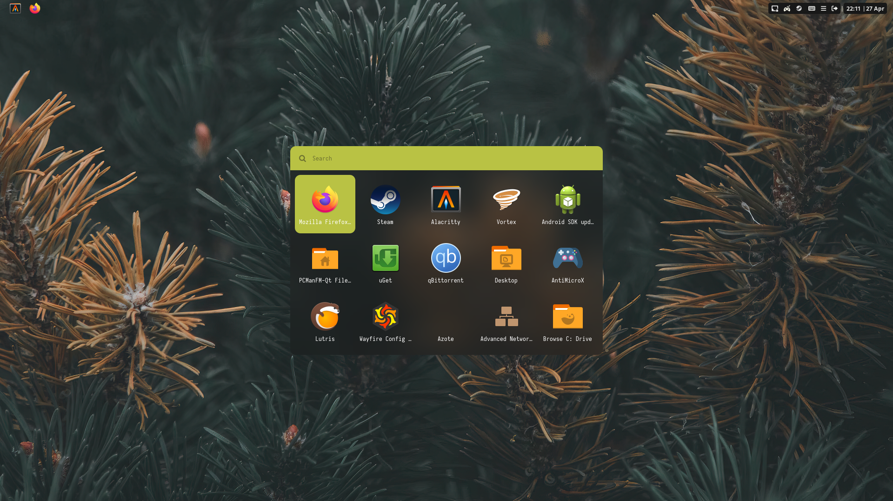
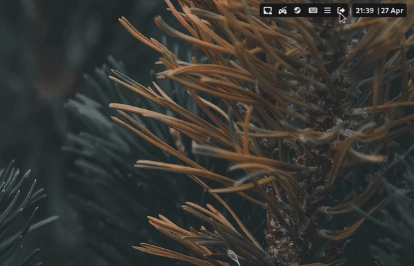

# Info
- Windows Manager: [wayfire](https://wayfire.org/)
- Bar: [waybar](https://github.com/Alexays/Waybar)
- Wallpaper: [Here](Pictures/wallpapers/wallhaven-8o8owk_1920x1080.png)
- Terminal: [alacritty](https://github.com/alacritty/alacritty)
- Terminal Multiplexer: [tmux](https://github.com/tmux/tmux)
- Notification Daemon: [mako](https://github.com/emersion/mako)
- Text Editor: [neovim](https://neovim.io/)
- Shell: [ZSH | Oh My Zsh](https://ohmyz.sh/)
- Distro: [Gentoo](https://www.gentoo.org/)
- Kernel: [linux-tkg-pds](https://github.com/Frogging-Family/linux-tkg)

# Screenshots

