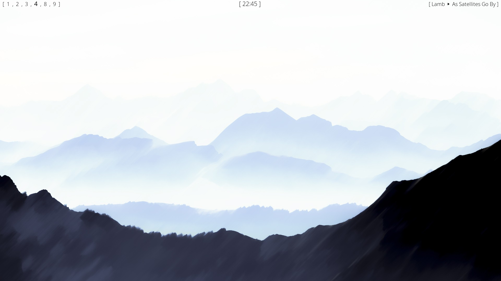
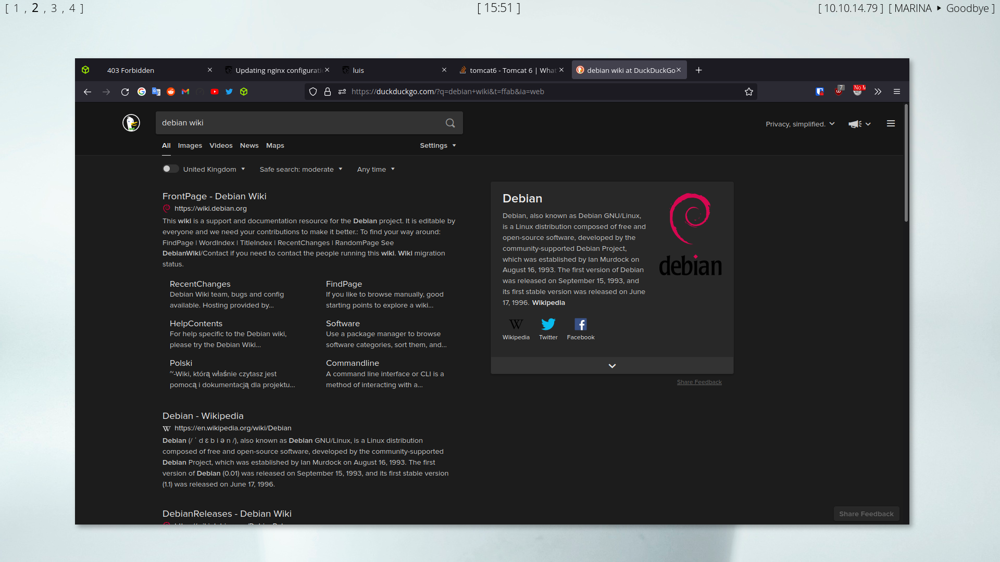
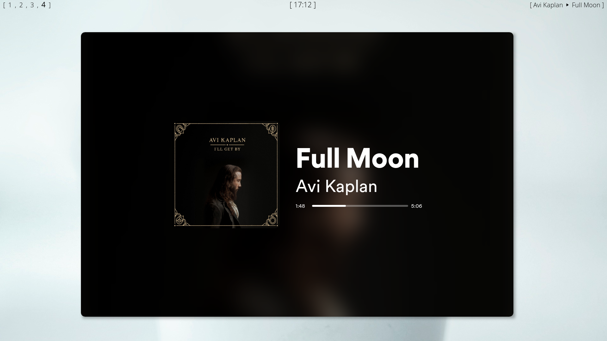
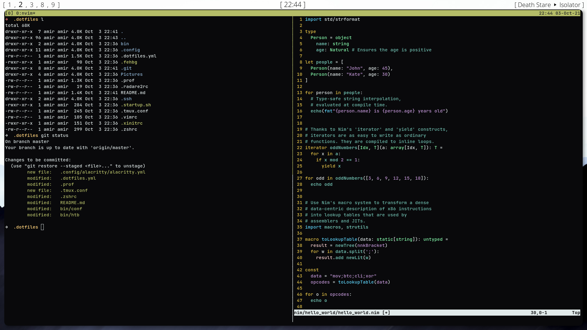

# Info
- Windows Manager: [i3-gaps](https://github.com/Airblader/i3) | [config](.config/i3/config)
- Bar: [polybar](https://github.com/polybar/polybar) | [config](.config/polybar/config)
- Terminal: [kitty](https://sw.kovidgoyal.net/kitty/) | [config](.config/kitty/kitty.conf)
- Fonts: [Open Sans](https://fonts.google.com/specimen/Open+Sans) | [Jet Brains](https://www.jetbrains.com/lp/mono/)
- Wallpaper: [this](Pictures/wallpapers/wallhaven-kw783d-1920x1080.png)
- Notification Deamon: [dunst](https://github.com/dunst-project/dunst) | [config](.config/dunst/dunstrc)
- Compositor: [picom-ibhagwan](https://github.com/ibhagwan/picom) | [config](.config/picom/picom.conf)
- Application Launcher: [rofi](https://github.com/davatorium/rofi) | [config](.config/rofi/style.rasi)
- Spotify Theme: [spicetify](https://github.com/khanhas/Spicetify) | [config](.config/spicetify/config-xpui.ini)
- Firefox Theme: [blurredfox](https://github.com/manilarome/blurredfox) | [config](.mozilla/firefox/24dd72wj.default-esr/chrome/colors/solid.css)

# Screenshots

